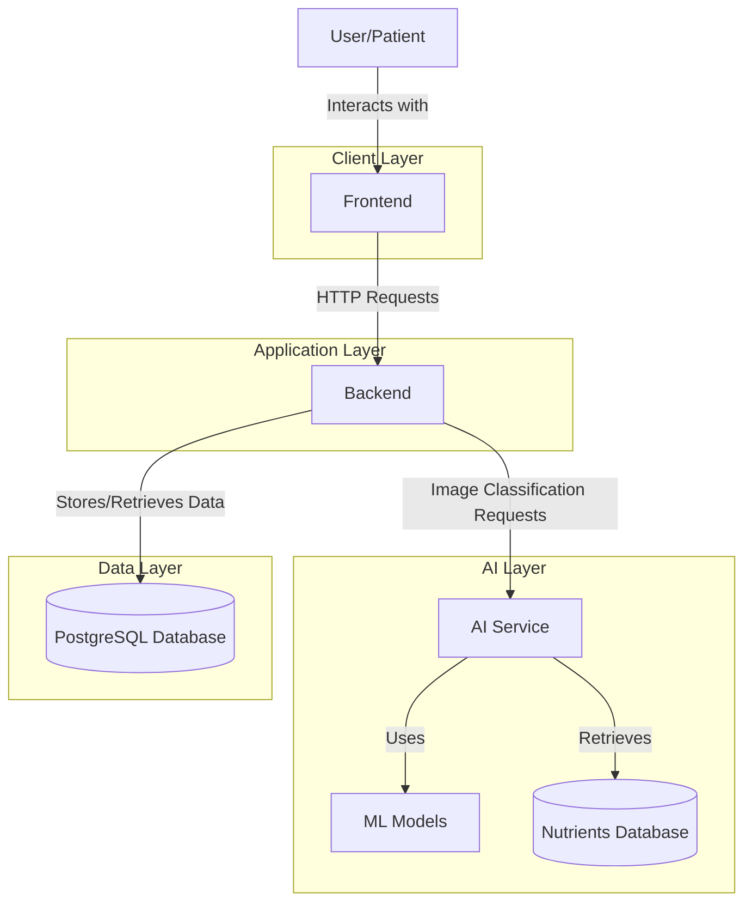
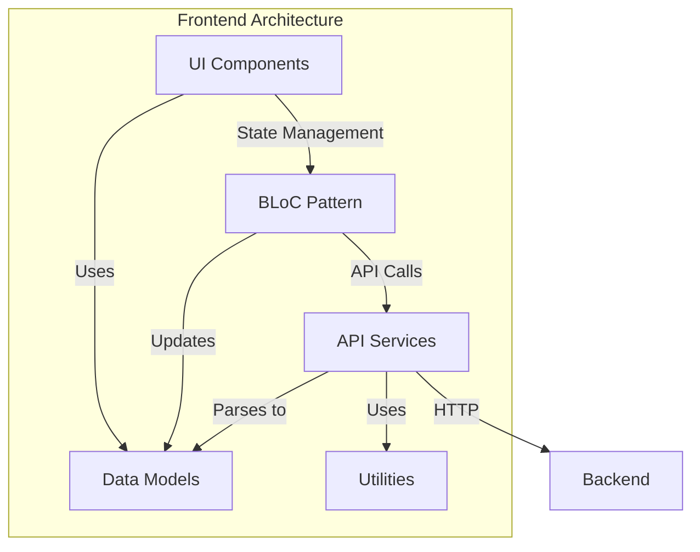
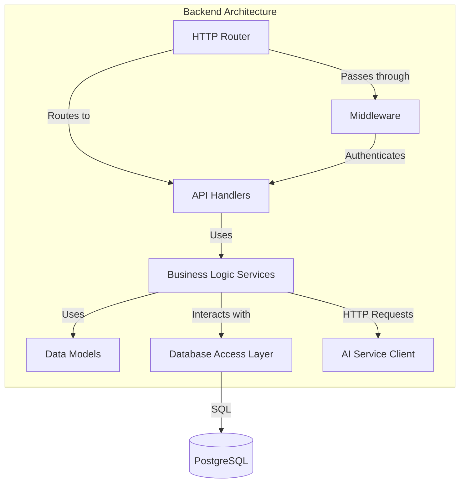
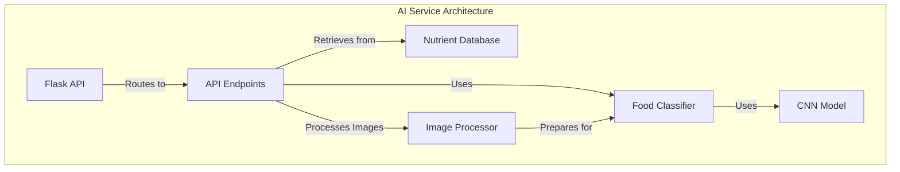
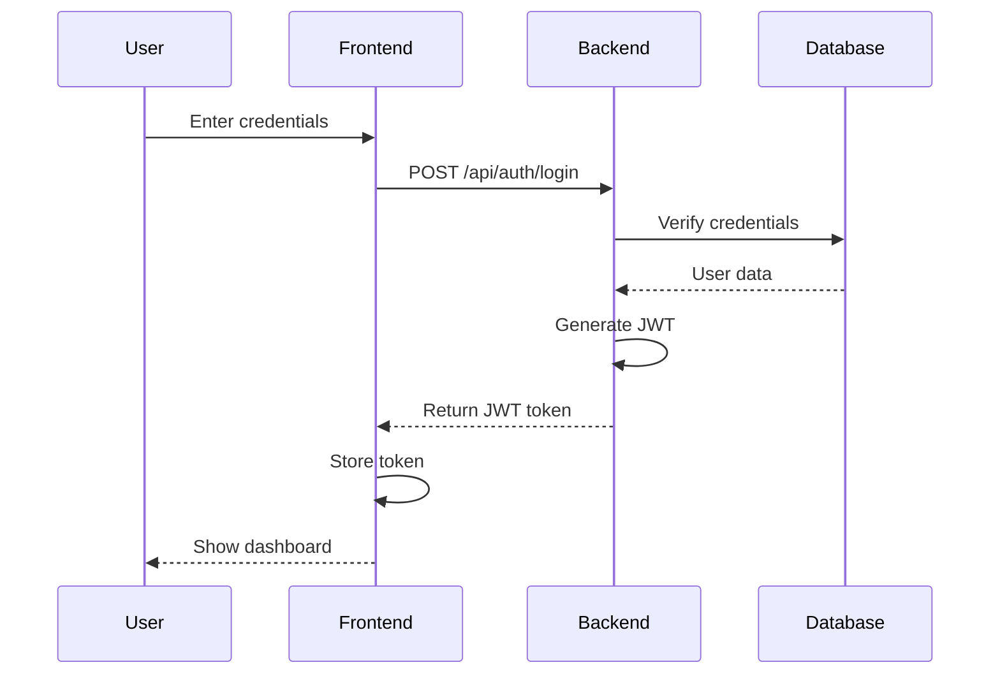
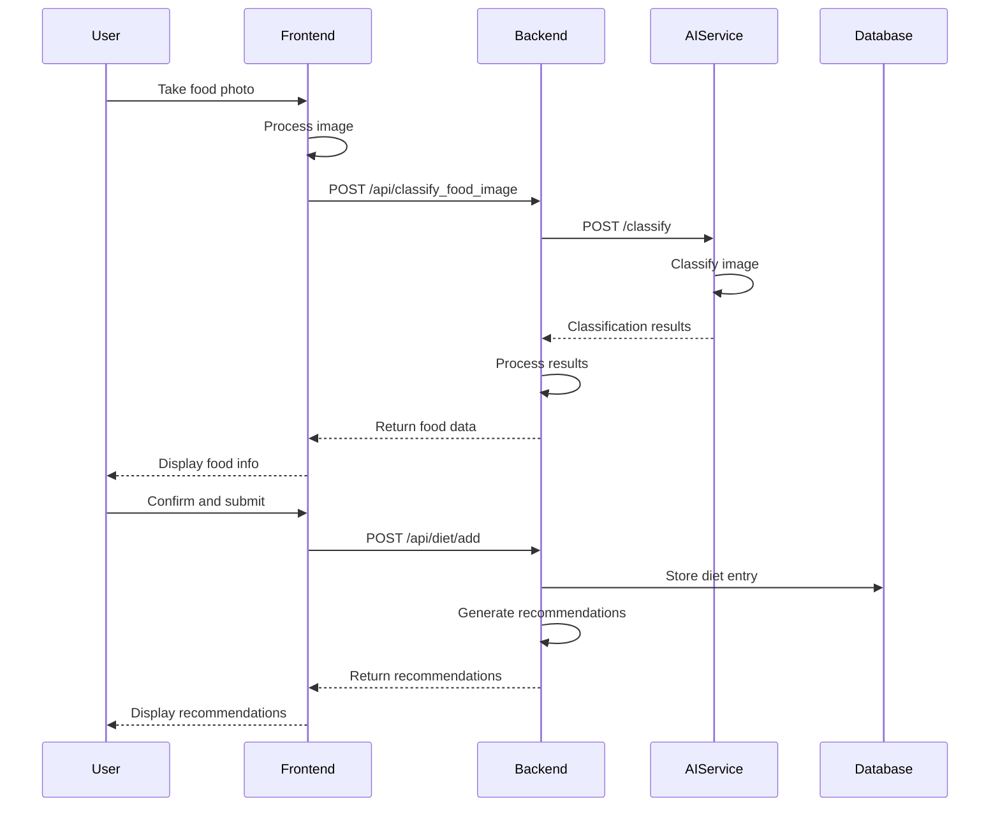
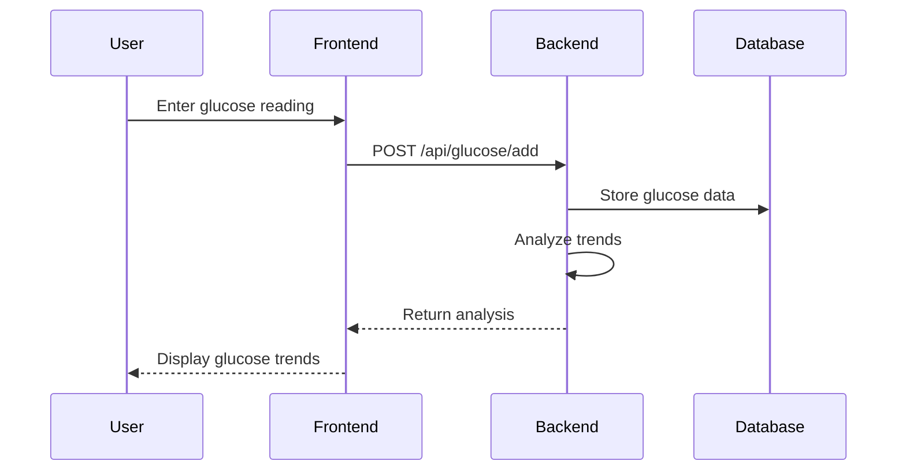
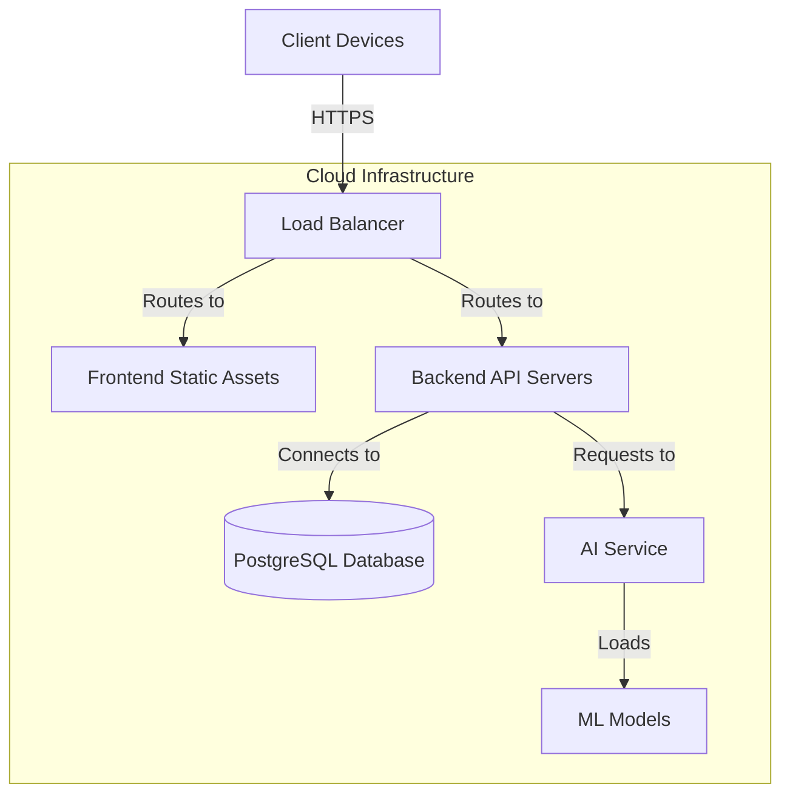

# Diabetes Tracker Application: System Architecture Overview

## 1. High-Level Architecture

The Diabetes Tracker Application follows a modern, microservices-oriented architecture with three primary components that work together to provide a comprehensive diabetes management solution.

## 2. Component Breakdown

### 2.1 Frontend (Flutter)

The frontend is built with Flutter, providing a cross-platform experience across iOS, Android, web, and desktop platforms.

**Key Components:**
- **Screens**: User interface screens for different functionalities
- **Widgets**: Reusable UI components
- **Services**: Handle API communication with the backend
- **Models**: Data structures representing application entities
- **State Management**: Using BLoC pattern for managing application state

### 2.2 Backend (Go)

The backend is built with Go, providing a high-performance, scalable API server.

**Key Components:**
- **HTTP Router**: Handles incoming HTTP requests and routes them to appropriate handlers
- **Middleware**: Handles cross-cutting concerns like authentication, logging, and error handling
- **API Handlers**: Process HTTP requests and return responses
- **Business Logic Services**: Implement application business logic
- **Data Models**: Define database schema and object relationships
- **Database Access Layer**: Manages database connections and operations
- **AI Service Client**: Communicates with the AI service for food classification

### 2.3 AI Service (Python/Flask)

The AI service is built with Python and Flask, providing food image classification and nutritional analysis.

**Key Components:**
- **Flask API**: Handles HTTP requests for food classification and model training
- **API Endpoints**: Define the service's API contract
- **Food Classifier**: Implements the classification logic
- **CNN Model**: Trained machine learning model for food image classification
- **Image Processor**: Preprocesses images for classification
- **Nutrient Database**: Stores nutritional information for classified foods

## 3. Data Flow

### 3.1 User Authentication Flow

### 3.2 Food Classification Flow

### 3.3 Glucose Tracking Flow

## 4. Technology Stack

### 4.1 Frontend
- **Framework**: Flutter (Dart)
- **State Management**: BLoC pattern
- **HTTP Client**: Dart http package
- **Local Storage**: SharedPreferences
- **Image Handling**: image_picker, flutter_image_compress
- **UI Components**: Material Design, custom widgets

### 4.2 Backend
- **Language**: Go
- **Web Framework**: Native Go HTTP or Gin
- **Database ORM**: Native SQL or GORM
- **Authentication**: JWT
- **API Documentation**: Swagger/OpenAPI
- **Logging**: Structured logging

### 4.3 AI Service
- **Language**: Python
- **Web Framework**: Flask
- **ML Framework**: TensorFlow/Keras
- **Image Processing**: OpenCV, PIL
- **Model Architecture**: MobileNetV2 (transfer learning)
- **Data Storage**: JSON for nutrient database

### 4.4 Database
- **DBMS**: PostgreSQL
- **Schema**: Relational database with tables for users, glucose readings, diet entries, medications, appointments, etc.

## 5. Integration Points

### 5.1 Frontend-Backend Integration
- RESTful API calls over HTTPS
- JWT authentication for secure communication
- JSON data format for request/response payloads

### 5.2 Backend-AI Service Integration
- RESTful API calls over HTTP (internal network)
- Base64 encoding for image transfer
- JSON data format for request/response payloads

### 5.3 Backend-Database Integration
- SQL queries via database driver
- Connection pooling for efficient resource usage
- Transactions for data integrity

## 6. Deployment Architecture

**Deployment Options:**
- **Frontend**: Static hosting (Firebase Hosting, AWS S3, etc.) for web; app stores for mobile
- **Backend**: Containerized deployment (Docker) on cloud platforms (AWS, GCP, Azure)
- **AI Service**: Containerized deployment with GPU support for training
- **Database**: Managed database service (AWS RDS, GCP Cloud SQL, etc.)

## 7. Security Considerations

### 7.1 Authentication & Authorization
- JWT-based authentication for API access
- Role-based access control for different user types (patients, healthcare providers)
- Token expiration and refresh mechanisms

### 7.2 Data Protection
- HTTPS for all client-server communication
- Database encryption for sensitive medical data
- Secure storage of credentials and tokens

### 7.3 API Security
- Rate limiting to prevent abuse
- Input validation to prevent injection attacks
- CORS configuration for web clients

### 7.4 Compliance
- HIPAA compliance for handling medical data
- GDPR considerations for user privacy
- Data retention policies

## 8. Scalability Considerations

### 8.1 Horizontal Scaling
- Stateless backend services for easy replication
- Load balancing across multiple instances
- Database read replicas for scaling read operations

### 8.2 Vertical Scaling
- GPU acceleration for AI service during high-demand periods
- Database instance sizing based on data volume and query complexity

### 8.3 Caching Strategy
- Client-side caching for UI assets
- Server-side caching for frequently accessed data
- Database query result caching

## 9. Monitoring and Observability

### 9.1 Logging
- Structured logging across all services
- Centralized log collection and analysis

### 9.2 Metrics
- Application performance metrics
- Infrastructure utilization metrics
- Business metrics (user engagement, feature usage)

### 9.3 Alerting
- Automated alerts for system issues
- Performance degradation detection
- Error rate monitoring

This comprehensive architecture provides a solid foundation for the Diabetes Tracker Application, ensuring scalability, security, and maintainability as the application grows and evolves.
